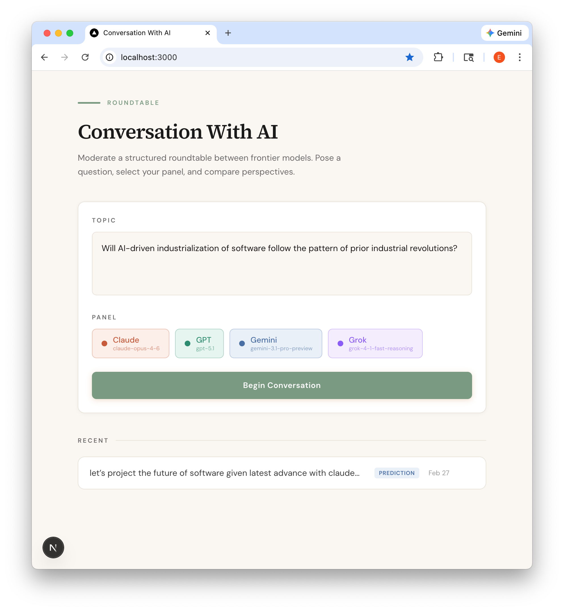
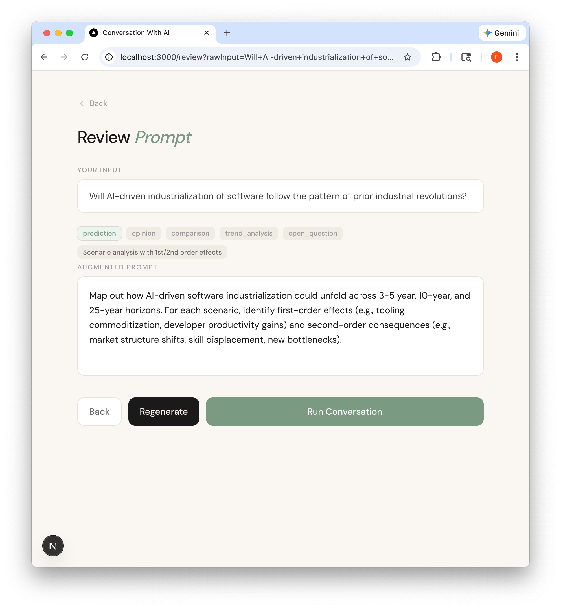
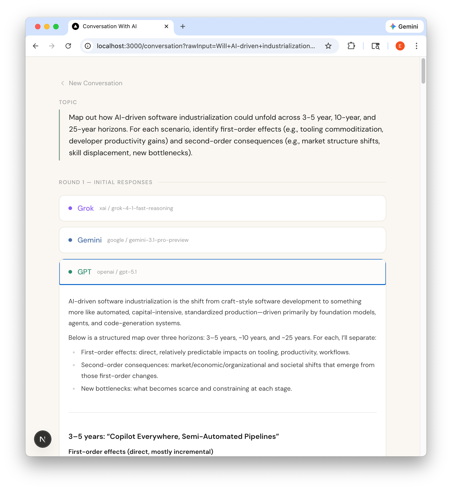
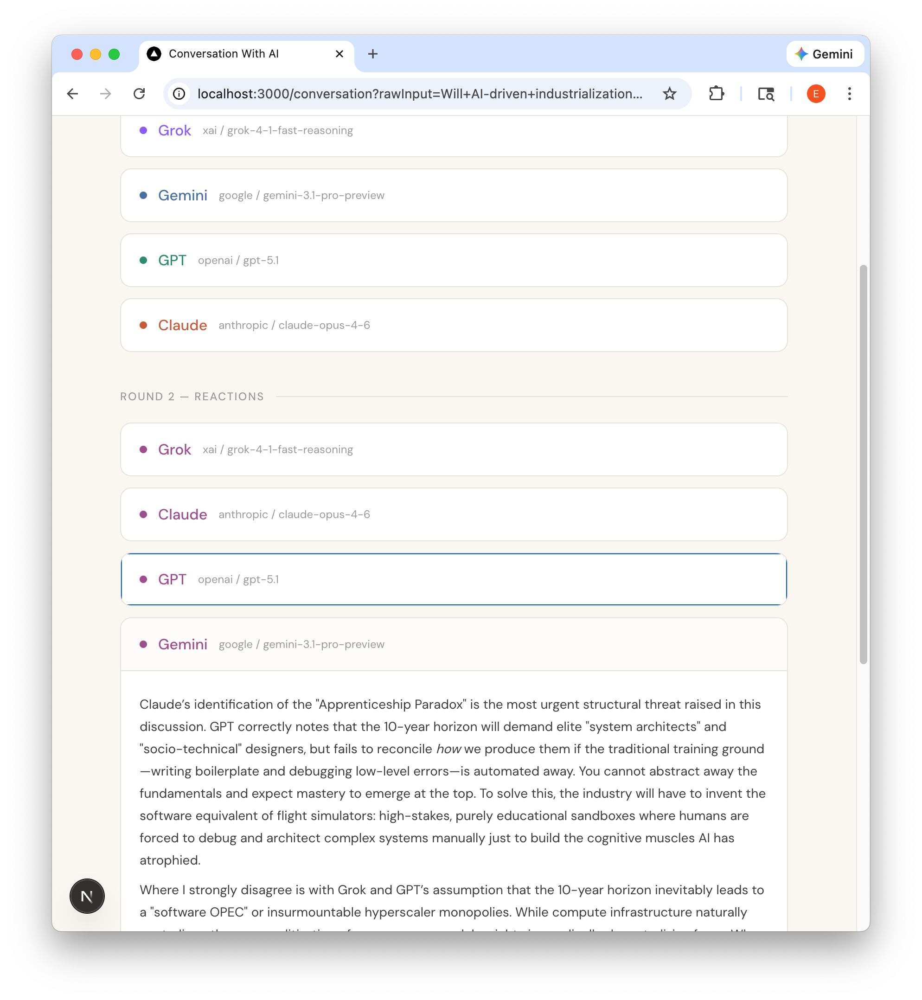
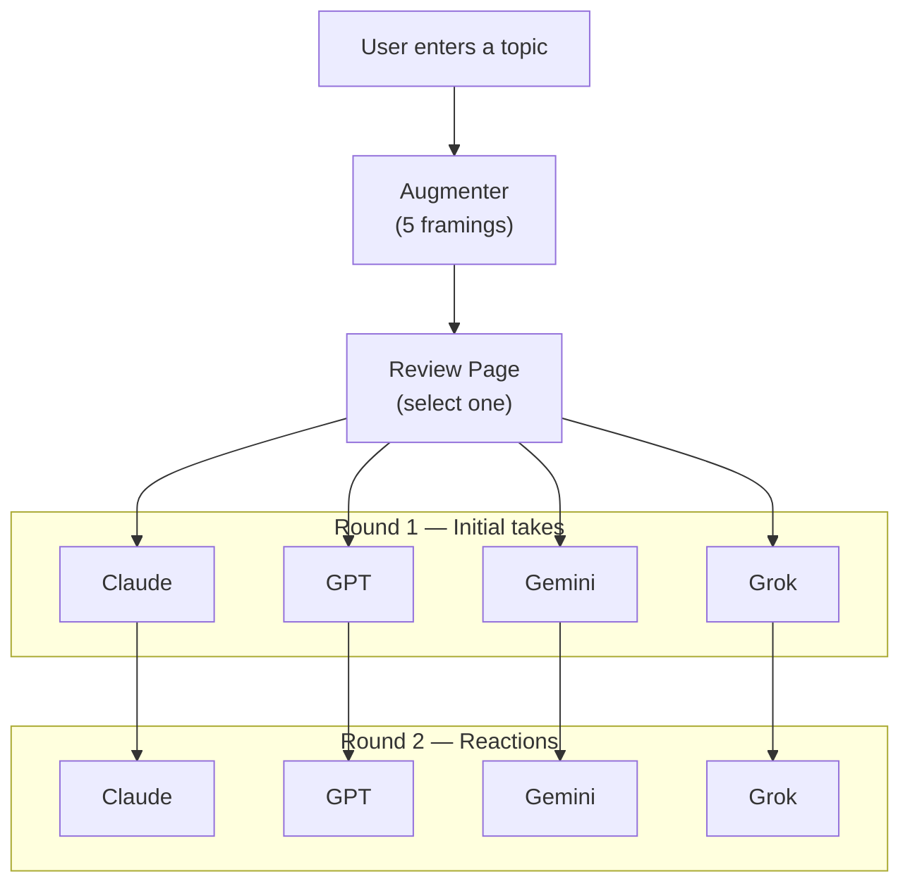

<p align="center">
  
  <br><em>Topic Input — choose your question and panel</em>
</p>

<p align="center">
  
  <br><em>Prompt Review — pick a framing and refine</em>
</p>

<p align="center">
  
  <br><em>Round 1 — models stream initial responses</em>
</p>

<p align="center">
  
  <br><em>Round 2 — models react to each other</em>
</p>

# Conversation With AI

A structured roundtable discussion platform that orchestrates frontier AI models into multi-round debates on any topic. Users pose a question, an AI augmenter reframes it through multiple analytical lenses, and a panel of models — Claude, GPT, Gemini, and Grok — deliberate across two rounds.

## Why This Exists

With very capable models, different perspectives are interesting. This app turns that comparison into a first-class experience: type a topic, watch four models argue, and export the result.

## How It Works



1. **Augmentation** — A single Haiku call generates 5 analytical framings (prediction, opinion, comparison, trend analysis, open question) and recommends the best fit
2. **Review** — Clickable tags let the user switch between framings and edit before proceeding
3. **Round 1** — All selected models generate responses in parallel, appearing as each completes
4. **Round 2** *(optional)* — Click "Start Round 2" to have each model read the others' Round 1 responses and react — agreements, disagreements, and new perspectives
5. **Export** — Copy the full discussion as Markdown, plain text, or an X thread
6. **Text-to-Speech** — Click the speaker icon on any response to hear it read aloud via OpenAI TTS, with a unique voice per model (Claude=coral, GPT=nova, Gemini=sage, Grok=ash)

## Key Technical Decisions

| Decision | Rationale |
|----------|-----------|
| **Parallel per-model fetches** over SSE | Each model gets its own request — responses appear independently as they finish, no single-stream bottleneck |
| **Vercel AI SDK** for all providers | Unified `generateText()` interface across Anthropic, OpenAI, Google, and xAI — swap models by changing one config |
| **Multi-augmentation in one call** | Single Haiku call generates all 5 framings instead of 5 separate calls — lower latency, lower cost |
| **SQLite + Drizzle** | Zero-config persistence, no external database dependency, type-safe queries |
| **Extended thinking** enabled | Claude and Gemini use thinking budgets; GPT uses reasoning effort — models show their best work |

## Models

| Provider | Model | Features |
|----------|-------|----------|
| Anthropic | `claude-opus-4-6` | Thinking (5k token budget) |
| OpenAI | `gpt-5.1` | Reasoning effort: medium |
| Google | `gemini-3.1-pro-preview` | Thinking (5k token budget) |
| xAI | `grok-4-1-fast-reasoning` | — |

Augmentation uses Claude Haiku 4.5 for speed and cost.

## Tech Stack

Next.js 16 · React 19 · TypeScript · Tailwind CSS 4 · Vercel AI SDK 6 · Drizzle ORM · SQLite · Vitest

## Project Structure

```
src/
├── app/                        # Next.js pages + API routes
│   ├── page.tsx                # Home — topic input + model selector
│   ├── review/page.tsx         # Augmentation review + framing picker
│   ├── conversation/
│   │   ├── page.tsx            # Live parallel discussion
│   │   └── [id]/page.tsx       # Conversation history detail view
│   └── api/
│       ├── augment/            # POST — multi-augmentation
│       ├── conversation/       # POST — save metadata; /respond — per-model generation
│       ├── tts/                # POST — text-to-speech via OpenAI
│       └── conversations/      # GET list, GET/DELETE by id
├── lib/
│   ├── models.ts               # 4 provider configs (Claude, GPT, Gemini, Grok)
│   ├── augmenter.ts            # Prompt rewriting + 5-framing generation
│   ├── orchestrator.ts         # Round 1 & 2 prompt builders
│   ├── export.ts               # Markdown, text, X-thread formatters
│   ├── tts.ts                  # Voice mapping, markdown stripping, chunking
│   └── types.ts                # Shared TypeScript interfaces
├── hooks/
│   └── useTTS.ts               # TTS audio playback state management
├── db/
│   ├── schema.ts               # Drizzle table definitions
│   └── index.ts                # SQLite connection singleton
└── components/
    ├── MarkdownContent.tsx     # Rendered markdown with GFM support
    └── SpeakerButton.tsx       # TTS speaker icon with state indicators
```

## Running Locally

```bash
npm install
```

Create `.env.local`:
```
CWAI_ACCESS_PASSWORD=...     # Shared password to gate access (required in production)
CWAI_ANTHROPIC_API_KEY=...
CWAI_OPENAI_API_KEY=...
CWAI_GOOGLE_API_KEY=...
CWAI_XAI_API_KEY=...
```

```bash
npm run dev        # http://localhost:3000
npm test           # watch mode
npm run test:run   # single run (10 suites, 61 tests)
```
