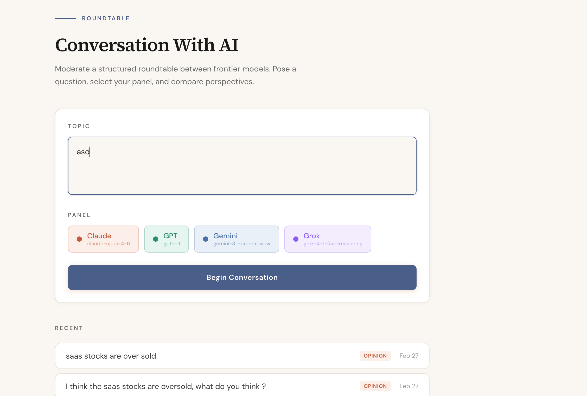
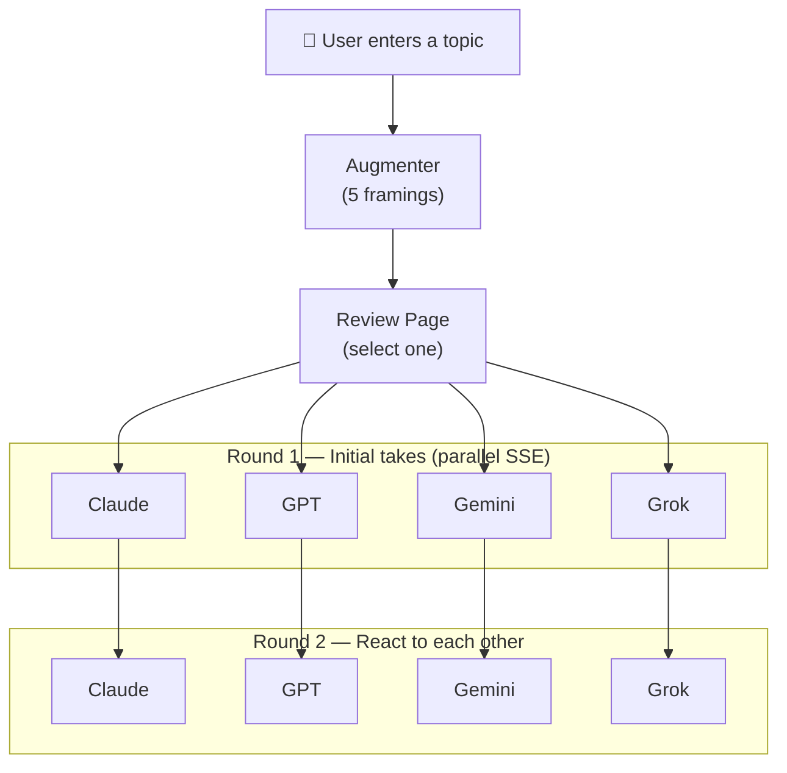

<p align="center">
  
</p>

# Conversation With AI

A structured roundtable discussion platform that orchestrates frontier AI models into multi-round debates on any topic. Users pose a question, an AI augmenter reframes it through multiple analytical lenses, and a panel of models — Claude, GPT, Gemini, and Grok — deliberate across two rounds with real-time streaming.

## Why This Exists

LLMs are increasingly capable, but comparing their reasoning on the same prompt is still hard. This app turns that comparison into a first-class experience: type a topic, watch four models argue, and export the result.

## How It Works



1. **Augmentation** — A single Haiku call generates 5 analytical framings (prediction, opinion, comparison, trend analysis, open question) and recommends the best fit
2. **Review** — Clickable tags let the user switch between framings and edit before proceeding
3. **Round 1** — All selected models stream responses in parallel via SSE, token-by-token
4. **Round 2** — Each model reads the others' Round 1 responses and reacts — agreements, disagreements, and new perspectives
5. **Export** — Copy the full discussion as Markdown, plain text, or an X thread

## Key Technical Decisions

| Decision | Rationale |
|----------|-----------|
| **SSE streaming** over WebSockets | Simpler protocol, natural fit for server-to-client token streams, no connection state to manage |
| **Vercel AI SDK** for all providers | Unified `streamText()` interface across Anthropic, OpenAI, Google, and xAI — swap models by changing one config |
| **Multi-augmentation in one call** | Single Haiku call generates all 5 framings instead of 5 separate calls — lower latency, lower cost |
| **SQLite + Drizzle** | Zero-config persistence, no external database dependency, type-safe queries |
| **Extended thinking** enabled | Claude and Gemini use thinking budgets; GPT uses reasoning effort — models show their best work |

## Tech Stack

Next.js 15 · React 19 · TypeScript · Tailwind CSS 4 · Vercel AI SDK · Drizzle ORM · SQLite · Vitest

## Project Structure

```
src/
├── app/                        # Next.js pages + API routes
│   ├── page.tsx                # Home — topic input + model selector
│   ├── review/page.tsx         # Augmentation review + framing picker
│   ├── conversation/page.tsx   # Live streaming discussion
│   └── api/
│       ├── augment/            # POST — multi-augmentation
│       ├── conversation/       # POST — SSE stream (rounds 1 & 2)
│       └── conversations/      # GET — history + detail
├── lib/
│   ├── models.ts               # 4 provider configs (Claude, GPT, Gemini, Grok)
│   ├── augmenter.ts            # Prompt rewriting + 5-framing generation
│   ├── orchestrator.ts         # Round 1 & 2 prompt builders
│   ├── export.ts               # Markdown, text, X-thread formatters
│   └── types.ts                # Shared TypeScript interfaces
├── db/
│   ├── schema.ts               # Drizzle table definitions
│   └── index.ts                # SQLite connection singleton
└── components/
    └── MarkdownContent.tsx     # Rendered markdown with GFM support
```

## Running Locally

```bash
npm install
```

Create `.env.local`:
```
CWAI_ANTHROPIC_API_KEY=...
CWAI_OPENAI_API_KEY=...
CWAI_GOOGLE_API_KEY=...
CWAI_XAI_API_KEY=...
```

```bash
npm run dev        # http://localhost:3000
npm test           # watch mode
npm run test:run   # single run (6 suites, 26 tests)
```
